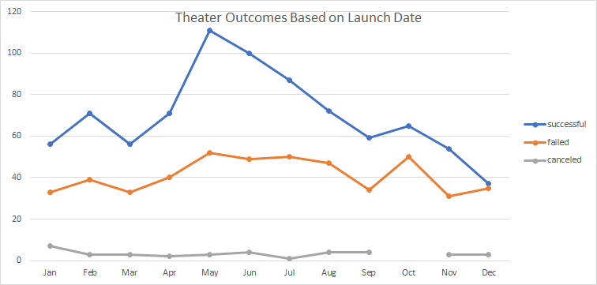

# An Analysis of Kickstarter Campaigns.

## Overview of Project
To learn about how to use Excel by using data on Kickstarter campaigns and helping to identify how Louise's play's fundraising fared in relation to other Kickstarter campaigns, in particularly in the Theater category

### Purpose
Identify how Fever's funding campaign compares to other kickstarter campaigns within the Theater venue.

## Analysis and Challenges
Part 1: How does time relate to a successful campaign. Does a particular time improve odds of a successful launch?
Part 2:How do goals affect the outcomes of the campaign?

### Analysis of Outcomes Based on Launch Date

### Analysis of Outcomes Based on Goals

### Challenges and Difficulties Encountered

## Results
